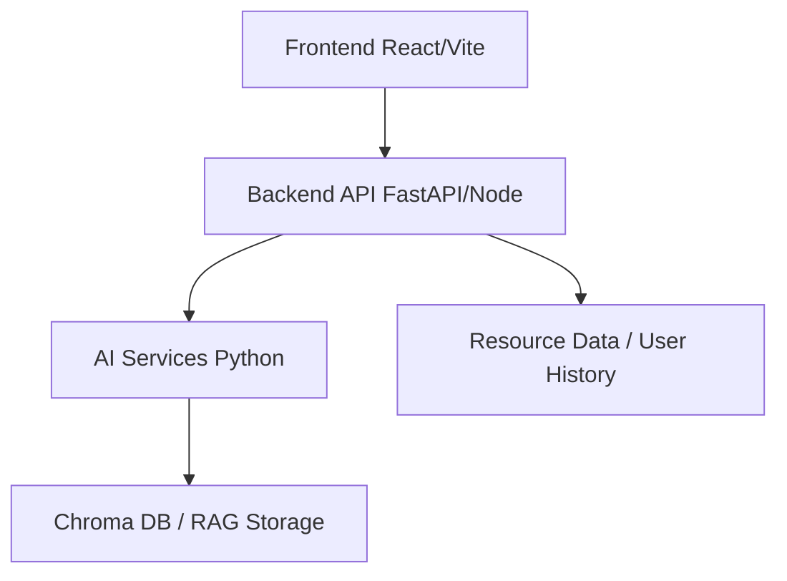

# Karmapath

An intelligent skill-assessment and learning recommendation platform designed to identify competency gaps and suggest targeted interventions.

## Overview
This platform provides an AI-powered capability assessment system. It is designed to evaluate employee skills against defined competency frameworks, analyze skill gaps, and provide personalized learning paths. By leveraging RAG (Retrieval-Augmented Generation) and semantic matching, it maps users' current capabilities to organizational requirements.

## Key Features
- **AI-Powered Assessments:** Dynamic assessment evaluation and question generation using LLMs.
- **Skill-Gap Identification:** Compares user responses to baseline competency maps.
- **Personalized Learning Paths:** Recommends targeted courses and resources based on identified gaps.
- **RAG-Based Document Functionality:** Query and retrieve context from uploaded resources (AskPDF integration).
- **Employee Dashboards:** Track personal progress, competencies, and recommended training.
- **Admin Functionality:** Dashboard for tracking overall training effectiveness and managing organizational resources.

## Architecture
The system follows a modern decoupled architecture:



## Project Structure
- `ai/` — Python AI services, semantic matching, evaluation logic, and recommendation engine.
- `backend/` — Python FastAPI (and Node implementations) for APIs, user history, and resource management.
- `frontend/app/` — Main React/Vite frontend application (Dashboards, Assessment UI, etc.).
- `askpdf/` — Standalone RAG-based document parsing and QA components.
- `design/` — UI/UX design artifacts and HTML/CSS mockups.
- `docs/` — Additional project documentation.
- `scripts/` — Helper scripts.

## Installation & Setup

### Prerequisites
- Python 3.10+
- Node.js (v18+)
- npm or yarn

### 1. Backend Setup
```fish
cd backend
python -m venv .venv
source .venv/bin/activate.fish
pip install -r requirements.txt
cp .env.example .env
# Edit .env with your actual API keys
python app/main.py
```

### 2. AI Services Setup
```fish
cd ai
python -m venv .venv
source .venv/bin/activate.fish
pip install -r requirements.txt
# Run experimental scripts or integration tests as needed
```

### 3. Frontend Setup
```bash
cd frontend/app
npm install
npm run dev
```

> **Note:** Virtual environments (`.venv`/`venv`) and `node_modules` are intentionally excluded from version control. You must run the above commands to recreate them locally.

## Environment Variables
Create a `.env` file in the `backend/` directory by copying `.env.example`:
```bash
cp backend/.env.example backend/.env
```
Ensure you populate `GEMINI_API_KEY` or any other relevant tokens required for LLM integration. **Never commit your `.env` file.**

## Running the Project
To run the full stack, you will need multiple terminal sessions.
1. **Backend:** Start the API server in `backend/` (e.g. `uvicorn app.main:app --reload`).
2. **Frontend:** Start the Vite dev server in `frontend/app/` (`npm run dev`).
3. **AskPDF (Optional):** Start the AskPDF node backend and frontend if document parsing is required.

## Data and Storage
- **Tracked Data:** Static JSON data for roles, initial competencies, and catalogs are tracked in `ai/data/`.
- **Generated Data:** User histories (`backend/data/history/`), uploaded resources, and Chroma DB caches (`ai/initial assisment/app/rag/chroma.db/`) are generated at runtime and ignored in Git.

## Troubleshooting
- **Missing Dependencies:** Ensure you have activated the correct virtual environment before running Python scripts.
- **API Errors:** Verify your `.env` file has the required and valid keys.
- **Frontend Issues:** Clear `node_modules` and run `npm install` again.

## Security
- Do not commit `.env` files, API keys, or private credentials.
- All `.env` variations and temporary cached files are handled by the repository's `.gitignore`.

## License
*Currently no license specified.*
